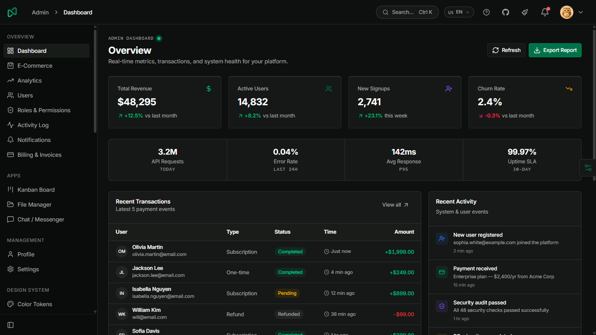

# Nala — Admin Dashboard Template

> A modern, production-ready admin dashboard template built with Vue 3, Vite, TypeScript, and Tailwind CSS v4.

[](https://nala.kenvano.web.id)
[](./LICENSE)
[](https://vuejs.org/)



---

## ✨ Features

- 🎨 **Beautiful UI** — Built with [shadcn-vue](https://www.shadcn-vue.com/) primitives via `reka-ui` (New York style)
- ⚡ **Official Scaffolding CLI** — Scaffold a fresh, production-ready starter project in seconds via `pnpm create nala my-app`
- 🌗 **Dark / Light / Auto Theme** — System preference detection + manual toggle via `@vueuse/core`
- 🎛️ **Live Theme Configurator** — Runtime palette switcher (7 OKLCH colors), radius scale presets, and fluid/boxed layout toggle with `localStorage` persistence
- 💼 **Enterprise Mini-Apps Suite** — Interactive **Kanban Task Board** (`/apps/kanban`) with HTML5 drag-and-drop, **File Manager & Media Library** (`/apps/file-manager`) with grid/list modes & upload dropzone, and **Messenger & Team Chat** (`/apps/chat`) with live simulated typing & status presence
- 📝 **Rich Text WYSIWYG Editor** — Tiptap-powered modular editor with rich typography toolbar, link & image popover embedding, live character/word counters, and length limit enforcement
- 🚀 **Specialized Dashboard Presets** — Main Analytics Console (`/dashboard`), E-Commerce Sales (`/dashboard/ecommerce`), and Traffic & Audience Telemetry (`/dashboard/analytics`)
- 📄 **Printable Invoice Template** — Pixel-perfect official tax invoice view (`/billing/invoice/:id`) with `@media print` optimization and line-item calculations
- 🌐 **Real API Client & Safe DEV Fallback** — Typed Axios service layer with silent token refresh, global loading bar, auto error toast notifications, and offline mock database
- ♿ **UX & Accessibility Standards** — Global Keyboard Shortcuts Helper (`?`), Multi-Language Selector Dropdown, and minimalist high-contrast Sonner toast notifications
- 📐 **Streamlined Sidebar** — Responsive layout with smooth `expanded` and `expand-on-hover` icon modes with cookie persistence
- 🔍 **Global Search** — Command palette with `Ctrl+K` / `Cmd+K` shortcut and category filtering
- 🔔 **Notification Center** — Slide-out drawer with unread badge counter and bulk actions
- 📊 **Chart Primitives** — Declarative charts powered by `@unovis/vue` & `@unovis/ts` (`AreaChart`, `BarChart`, `LineChart`, `DonutChart`) with dynamic theme color, dark mode support, and reactive timeframe switching
- 📈 **Standardized KPI Cards** — Reusable metric stats blueprint (`<Card flush>` + `<CardContent class="p-5 space-y-2">`) with semantic trend indicators (`ArrowUpRight` / `ArrowDownRight`) applied consistently across all dashboards
- 📋 **Data Table** — Powered by `@tanstack/vue-table` with sorting, filtering, and pagination
- ✅ **Form & Validation** — `vee-validate` + `zod` schema validation with rich input primitives (PIN/OTP, date picker, combobox, file upload)
- 🗂️ **Auth Flow** — Login, Register, Forgot Password, OTP Verify, Reset Password, Confirm Email, Lock Screen
- 🚫 **Error Pages** — 404 Not Found, 500 Server Error, 403 Access Denied, Maintenance Mode, Coming Soon
- 🧩 **46+ UI Primitives** — RichTextEditor, Chart, Toggle, ToggleGroup, ContextMenu, ScrollArea, PinInput, Sonner, and all shadcn-vue primitives ready to use
- 🎯 **Component Showcase** — Buttons, Forms, Rich Text Editor, Modals, Cards, Tables, Charts, Overlays, Badges, Toasts, Navigation, Typography, Colors, Icons

---

## 🛠️ Tech Stack

| Layer | Technology | Details / Notes |
|---|---|---|
| **Framework** | Vue 3 (Composition API) | Modern script setup (`<script setup lang="ts">`) |
| **Build Tool** | Vite 8 (`@vitejs/plugin-vue`) | Lightning-fast HMR and production bundler |
| **Package Manager** | `pnpm` v10+ (Workspaces) | Monorepo architecture managed via `pnpm-workspace.yaml` |
| **Auto-Imports** | `unplugin-auto-import` & `unplugin-vue-components` | Zero-boilerplate auto-imports for Vue, Pinia, Router, & UI primitives |
| **Styling** | Tailwind CSS v4 + `tw-animate-css` | Native OKLCH color tokens, dynamic gradients, and animations |
| **UI Primitives** | `reka-ui` + shadcn-vue | 46+ accessible UI primitives in New York style |
| **Rich Text Editor** | Tiptap (`@tiptap/vue-3`) | Modular WYSIWYG editor with formatting toolbar & image popovers |
| **Charts** | `@unovis/vue` + `@unovis/ts` | Declarative SVG area, bar, line, and donut charts with dark mode |
| **Data Table** | `@tanstack/vue-table` | Headless data table with sorting, filtering, and pagination |
| **Form & Validation** | `vee-validate` + `@vee-validate/zod` + `zod` | Strongly-typed form validation schemas |
| **Icons** | `@lucide/vue` | Modern, consistent icon library |
| **State Management** | Pinia | Modular Setup Store architecture |
| **Routing** | Vue Router v5 | HTML5 history mode with transition progress bars & auth guards |
| **API Client** | Axios + Enterprise Interceptors | Silent token refresh queue, top loading bar, and auto error toasts |
| **CLI Scaffolder** | `@clack/prompts` + `kolorist` + `tsup` | Powers interactive `pnpm create nala` starter generator |
| **Testing** | Vitest + `@vue/test-utils` + `happy-dom` | Fast unit and component test runner |
| **Notifications** | `vue-sonner` | Minimalist, high-contrast toast notification system |
| **Type System** | TypeScript 6 + `vue-tsc` | Strict static typing with zero `any` policy |

---

## 🔗 Live Demo

**[https://nala.kenvano.web.id](https://nala.kenvano.web.id)**

---

## ⚡ Quick Start (Create a New Project)

Scaffold a clean, production-ready Nala admin application in seconds using the official CLI:

### with `pnpm` (Recommended)
```bash
pnpm create nala my-admin-app
```

### with `npm`
```bash
npm create nala@latest my-admin-app
```

### with `bun`
```bash
bun create nala my-admin-app
```

Then navigate into your project and start the development server:
```bash
cd my-admin-app
pnpm install
pnpm dev
```

---

## 🛠️ Monorepo & Development Setup

This repository is organized as a **pnpm monorepo**:
- **`packages/showcase/`** — Full enterprise demo application with 44+ UI primitives, interactive documentation, and comprehensive showcase views.
- **`packages/create-nala/`** — The official scaffolding CLI and clean starter template published to npm.

### Prerequisites

- [Node.js](https://nodejs.org/) v20+
- [pnpm](https://pnpm.io/) v9+ (`npm install -g pnpm`)

### Local Monorepo Setup

```bash
# 1. Clone the repository
git clone https://github.com/candrasp/Nala.git
cd nala

# 2. Install workspace dependencies
pnpm install

# 3. Start the showcase demo server
pnpm dev
```

The showcase app will be available at **http://localhost:5173**.

---

## 📁 Repository Structure

```
nala/                                    ← Root monorepo
├── packages/
│   ├── showcase/                        ← Full enterprise demo application (@nala/showcase)
│   │   ├── public/                      ← Static assets, icons, screenshots
│   │   ├── src/
│   │   │   ├── assets/fonts/            ← Local font assets (Inter woff2)
│   │   │   ├── components/
│   │   │   │   ├── layout/              ← AppNavbar, AppSidebar, NotificationDrawer, ThemeCustomizer, etc.
│   │   │   │   ├── ui/                  ← 46+ UI primitives (reka-ui / shadcn-vue + Tiptap)
│   │   │   │   ├── AppLogo.vue          ← Responsive brand logo component
│   │   │   │   ├── CodePreview.vue      ← Interactive code preview with One Dark Pro theme
│   │   │   │   ├── EmptyState.vue       ← Reusable empty state placeholder
│   │   │   │   └── PageHeader.vue       ← Standardized page header component
│   │   │   ├── composables/             ← useFormatter.ts, useThemeConfig.ts
│   │   │   ├── layouts/                 ← AdminLayout.vue, AuthLayout.vue
│   │   │   ├── lib/                     ← axios.ts, formatters.ts, loading-bar.ts, utils.ts
│   │   │   ├── router/                  ← Full demo routes & guards
│   │   │   ├── services/                ← Real API service layer + DEV mock fallbacks
│   │   │   ├── stores/                  ← Pinia stores (auth, notification, activity, billing, role, chat, etc.)
│   │   │   └── views/                   ← 30+ demo views (Dashboard, Apps, E-Commerce, RBAC, etc.)
│   │   ├── components.json              ← shadcn-vue configuration
│   │   ├── vite.config.ts               ← Vite bundler & auto-import configuration
│   │   └── package.json                 ← Showcase dependencies
│   │
│   └── create-nala/                     ← Official scaffolding CLI tool (create-nala on npm)
│       ├── src/
│       │   ├── index.ts                 ← Interactive CLI wizard (@clack/prompts + kolorist)
│       │   └── utils.ts                 ← Template transformation, variable replacement & copying
│       ├── template/                    ← Clean starter template for new user projects
│       │   ├── src/
│       │   │   ├── components/ui/       ← 46+ core UI primitives (zero showcase bloat)
│       │   │   ├── layouts/             ← Clean AdminLayout & AuthLayout
│       │   │   ├── router/              ← Minimal router (Dashboard, Blank, Auth, Errors)
│       │   │   ├── services/            ← auth.service.ts, user.service.ts
│       │   │   ├── stores/              ← auth.ts store
│       │   │   └── views/               ← Minimal Dashboard, BlankView, Auth, Error views
│       │   ├── _gitignore               ← Clean gitignore template (renamed on scaffold)
│       │   └── package.json             ← Minimal starter dependencies
│       ├── tsup.config.ts               ← CLI TypeScript bundler configuration
│       └── package.json                 ← CLI package configuration (bin: ./dist/index.js)
│
├── pnpm-workspace.yaml                  ← pnpm workspace definition
├── package.json                         ← Root scripts (dev, build, preview, test, build:cli, sync:ui)
├── DEVELOPMENT.md                       ← Comprehensive contributor and developer guide
├── CHANGELOG.md                         ← Version release notes & history
├── ROADMAP.md                           ← Project milestones & version roadmap
├── MOCKING.md                           ← Safe DEV mock service guidelines
└── LICENSE                              ← MIT License
```

For a detailed guide on contributing and maintaining packages, see [DEVELOPMENT.md](./DEVELOPMENT.md).

---

## 📄 Available Pages

### 💼 Enterprise Mini-Apps
| Route | Name | Description |
|---|---|---|
| `/apps/kanban` | Kanban Board | Interactive workflow board with 4 columns, HTML5 drag-and-drop, Zod task modal, subtask meter & KPI stats |
| `/apps/file-manager` | File Manager | Media library with Grid/List view modes, folder tree & breadcrumb bar, storage stats, preview drawer & upload dropzone |
| `/apps/chat` | Messenger & Chat | Live team chat with presence dots, You vs Peer bubble threads, simulated typing responses & quick reply chips |

### 📊 Overview & Management

| Route | Name | Description |
|---|---|---|
| `/` | Dashboard | Main overview KPI stats (standardized metric cards), area charts with timeframe switching, recent activity table |
| `/dashboard/ecommerce` | E-Commerce | Sales revenue timeline, top-selling products & order fulfillment |
| `/dashboard/analytics` | Analytics | Traffic volume, acquisition channels, device mix & country demographics |
| `/users` | User Management | Full CRUD dialogs with dev offline mock fallback |
| `/roles` | Role & Permissions | Interactive permission matrix, role management & assignment |
| `/activity` | Activity Logs | System audit log viewer with search, filtering & export |
| `/billing` | Billing & Plans | Subscription tier cards, payment methods & invoice history |
| `/billing/invoice/:id` | Invoice Detail | Printable official tax invoice view with @media print & action toolbar |
| `/notifications` | Notifications | Full notification center with filter, search & action triggers |
| `/profile` | User Profile | User profile overview, account stats, activity timeline |
| `/settings` | Settings | Multi-tab settings (Profile, Security 2FA, Notifications, Appearance) |

### 🎨 Design System & Foundations

| Route | Name | Description |
|---|---|---|
| `/components/colors` | Color Tokens | Full color token reference (oklch palette, light + dark mode) |
| `/components/typography` | Typography | Heading scales, body text, code blocks, prose |
| `/components/icons` | Icon Directory | Searchable Lucide icon catalog with JSX/Vue tag copy |
| `/components/formatters` | Formatters & Utils | Intl data helpers (Currency, Date/Time, 12h/24h, Timezone, Bytes) |

### 🧩 UI Components Showcase

| Route | Name | Description |
|---|---|---|
| `/components/buttons` | Buttons | All button variants, sizes, icons, loading, and micro-actions |
| `/components/badges` | Badges & Avatars | Pill badges, live status dots, avatar presence & group stacks |
| `/components/cards` | Cards & Surfaces | Stats cards, flush cards, ambient glow, interactive cards |
| `/components/forms` | Form & Inputs | Input variants, select, date picker, switch, slider, stepper |
| `/components/editor` | Rich Text Editor | Tiptap WYSIWYG editor with formatting toolbar, image/link popovers & live word/char counters |
| `/components/tables` | Data Tables | Sortable columns, row selection, pagination, and filters |
| `/components/charts` | Charts & Analytics | Unovis-powered area, bar, line, and donut charts with dark mode & theme color support |
| `/components/modals` | Modals & Dialogs | Standard dialog, alert confirm, form in modal, drawer sheet |
| `/components/overlays` | Overlays & Drawers | Tooltip, popover, hover card, and sheet panels |
| `/components/toasts` | Toast & Alerts | Sonner toast triggers (success, error, promise, action) |
| `/components/feedback` | Feedback & Loading | Skeleton loaders, progress bars, alert banners, spinners |
| `/components/navigation` | Navigation & Flow | Tabs, breadcrumbs, pagination, steppers, and timelines |

### 🔐 Authentication Suite

| Route | Name | Description |
|---|---|---|
| `/auth/login` | Login | Email/password login with demo auto-fill credentials |
| `/auth/register` | Register | Registration form with real-time password strength meter |
| `/auth/forgot-password` | Forgot Password | Recovery email request with resend cooldown timer |
| `/auth/verify-otp` | Verify OTP | 6-digit segmented OTP input with auto-advance & paste |
| `/auth/reset-password` | Reset Password | Token-based new password setup |
| `/auth/confirm-email` | Confirm Email | Email confirmation waiting state with polling simulation |
| `/auth/2fa` | Two-Factor (2FA) | 6-digit TOTP authenticator challenge with trusted device option & backup code recovery |
| `/auth/sso` | Enterprise SSO | Corporate domain detection with Okta, Azure AD, Google Workspace & SAML 2.0 |
| `/auth/magic-link` | Magic Link | Passwordless email authentication with animated confirmation & mailbox launcher |
| `/auth/lock-screen` | Lock Screen | Session lock with avatar, password unlock & switch account |
| `/auth-split/login` | Split-Screen Auth | Modern 2-column layout with ambient OKLCH hero banner & testimonial carousel |

### 📄 Pages & Error States

| Route | Name | Description |
|---|---|---|
| `/landing` | Landing Page | Clean product landing page showcase |
| `/starter/blank` | Blank Page | Clean starter canvas for building new features |
| `/errors/404` | 404 Not Found | Illustrated not found page with quick recovery links |
| `/errors/500` | 500 Server Error | Server error page with trace ID chip and retry simulation |
| `/errors/403` | 403 Access Denied | Polished unauthorized access guidance |
| `/errors/maintenance` | Maintenance | Scheduled maintenance with live countdown & email notification |
| `/errors/coming-soon` | Coming Soon | Product launch countdown with VIP early access waitlist |

---

## 🎨 Design System

### Color Tokens

All colors use CSS custom properties based on the **oklch** color space, with full light and dark mode support.

```css
/* Key tokens */
--background / --foreground       /* Page background & primary text */
--primary / --primary-foreground  /* Brand accent (buttons, active links) */
--secondary / --secondary-foreground
--muted / --muted-foreground      /* Subtle text, placeholders */
--accent / --accent-foreground    /* Hover states */
--destructive                     /* Danger actions (delete, error) */
--border                          /* All borders */
--card / --card-foreground        /* Card backgrounds */
--sidebar / --sidebar-*           /* Sidebar-specific tokens */
```

### Theme Switching

Theme is managed via `useColorMode` from `@vueuse/core`. Three modes supported:

- `light` — Force light mode
- `dark` — Force dark mode
- `auto` — Follow OS preference (default)

### Live Theme Customizer & Configurator

Nala features a built-in runtime theme customizer drawer (`ThemeCustomizer.vue`) and composable (`useThemeConfig.ts`) allowing users to tailor design tokens live with zero page reloads:

- 🎨 **7 Primary Accent Colors (OKLCH)** — *Emerald, Indigo, Violet, Rose, Amber, Cyan, Zinc* dynamically updating CSS variables across all components and charts.
- 📐 **6 Border Radius Presets** — `0` (Sharp), `0.25rem`, `0.375rem`, `0.5rem`, `0.75rem`, `1.0rem`.
- 🔲 **Content Width Modes** — Toggle between **Fluid** (100% full-width layout) and **Boxed** (`max-w-7xl` centered container).
- 💾 **Automatic Persistence** — User theme preferences are saved to `localStorage` via `@vueuse/core` (`useStorage`).
- ⚙️ **Production Control** — Toggle visibility of the floating customizer drawer trigger via `VITE_SHOW_THEME_CUSTOMIZER=true/false` in your `.env`.

#### Programmatic Customization

```vue
<script setup lang="ts">
// useThemeConfig is auto-imported globally
const { config, setPrimaryColor, setRadius, setContentWidth, resetConfig } = useThemeConfig()
</script>

<template>
  <!-- Switch primary accent -->
  <button @click="setPrimaryColor('emerald')">Emerald</button>
  
  <!-- Switch border radius -->
  <button @click="setRadius('0.5')">Medium Radius</button>
  
  <!-- Switch layout container -->
  <button @click="setContentWidth('boxed')">Boxed Container</button>
</template>
```

---

## 🧩 Extending This Template

### Adding a New Page

1. **Create the view** — `src/views/<feature>/IndexView.vue`
2. **Register the route** — Add to `children[]` in `src/router/index.ts`
3. **Add to sidebar** — Add entry to the appropriate `nav` array in `src/components/layout/AppSidebar.vue`
4. **Add to command palette** — Add entry in `src/components/layout/CommandSearchDialog.vue`

```ts
// 1. router/index.ts
{ path: 'products', name: 'products', component: () => import('@/views/products/IndexView.vue') }

// 2. AppSidebar.vue — add to the relevant nav group array
{ name: 'Products', routeName: 'products', href: '/products', icon: Package }

// 3. CommandSearchDialog.vue — add to the search items list
{ name: 'Products', description: 'Product management', href: '/products', icon: Package }
```

### Adding a Pinia Store

```ts
// src/stores/products.ts
import { defineStore } from 'pinia'

export interface Product { id: string; name: string; price: number }

export const useProductStore = defineStore('products', () => {
  const items = ref<Product[]>([])
  const isLoading = ref(false)

  async function fetchAll() {
    isLoading.value = true
    try {
      // const { data } = await axios.get('/api/products')
      // items.value = data
    } finally {
      isLoading.value = false
    }
  }

  return { items, isLoading, fetchAll }
})
```

### Adding Route Guards

The template ships without active route guards to keep it flexible. To add auth protection, update `src/router/index.ts`:

```ts
import { useAuthStore } from '@/stores/auth'

router.beforeEach((to, _from, next) => {
  const authStore = useAuthStore()
  const publicRoutes = ['login', 'register', 'forgot-password']

  if (!publicRoutes.includes(to.name as string) && !authStore.isAuthenticated) {
    next({ name: 'login' })
  } else {
    next()
  }
})
```

### Data Formatting (`useFormatter`)

All formatting helpers are **auto-imported**. Developers can use `useFormatter()` anywhere without explicit imports:

```vue
<script setup lang="ts">
const fmt = useFormatter()
</script>

<template>
  <!-- Currency (auto follows .env: USD, IDR, EUR, etc.) -->
  <span>{{ fmt.currency(1500000) }}</span>

  <!-- Date & Time (auto follows .env locale & timezone: WIB/WITA/WIT/UTC) -->
  <span>{{ fmt.date(row.createdAt, 'long') }}</span>
  <span>{{ fmt.dateTime(row.createdAt) }}</span>
  <span>{{ fmt.relative(row.lastActive) }}</span>

  <!-- Numbers & File Sizes -->
  <span>{{ fmt.number(1250000) }}</span>
  <span>{{ fmt.compact(2500000) }}</span>
  <span>{{ fmt.bytes(file.size) }}</span>
  <span>{{ fmt.initials(user.name) }}</span>
</template>
```

| Method | Example Input | Default Output (.env IDR / id-ID) | Description |
| :--- | :--- | :--- | :--- |
| `fmt.currency(val, opts?)` | `1500000` | `Rp 1.500.000` | Localized currency formatting |
| `fmt.number(val)` | `1250000` | `1.250.000` | Thousand separators |
| `fmt.compact(val)` | `2500000` | `2,5 jt` / `2.5M` | Compact metric notation |
| `fmt.date(val, style?)` | `'2026-08-21'`, `'long'` | `21 Agustus 2026` | Date (`short`, `medium`, `long`, `full`) |
| `fmt.dateTime(val, opts?)` | `ISO string` | `21 Agt 2026, 14.30` | Date with time & 24h/12h options |
| `fmt.time(val, opts?)` | `ISO string` | `14:30` (or `02:30 PM`) | Time-only (`24h`, `12h`, `showSeconds`) |
| `fmt.relative(val)` | `Date` (past/future) | `5 menit yang lalu` / `baru saja` | Human-friendly relative time |
| `fmt.bytes(val)` | `1048576` | `1 MB` | Storage byte sizes |
| `fmt.initials(name)` | `'Olivia Martin'` | `'OM'` | 2-letter uppercase Avatar fallback |

---

## ⚙️ Environment Variables

Copy `.env.example` and fill in your values:

```bash
cp .env.example .env
```

| Variable | Description | Default |
|---|---|---|
| `VITE_API_BASE_URL` | Backend API base URL | `http://localhost:3000` |
| `VITE_APP_NAME` | Application name shown in UI | `Nala` |
| `VITE_DEFAULT_LOCALE` | Global locale for dates, numbers, currency (`en-US`, `id-ID`, etc.) | `en-US` |
| `VITE_DEFAULT_CURRENCY` | Global currency code (`USD`, `IDR`, `EUR`, etc.) | `USD` |
| `VITE_DEFAULT_TIMEZONE` | Global timezone (`Asia/Jakarta`, `UTC`, etc.) | `Asia/Jakarta` |
| `VITE_DEFAULT_TIME_FORMAT` | Global time clock format (`24h`, `12h`, `auto`) | `24h` |
| `VITE_SHOW_THEME_CUSTOMIZER` | Show/hide the live theme customizer drawer and navbar trigger | `true` |

---

## 📦 Scripts

```bash
pnpm dev      # Start dev server with HMR (http://localhost:5173)
pnpm build    # Type-check + build for production
pnpm preview  # Preview production build locally
```

---

## 🚀 Deployment

For production deployment instructions on Vercel, Netlify, Cloudflare Pages, GitHub Pages, Docker, and Nginx VPS, see the [Deployment Guide](./DEPLOYMENT.md).

---

## 📝 License

MIT License — free to use for personal and commercial projects.

---

<p align="center">
  Built with ❤️ using Vue 3 + Vite + Tailwind CSS v4
</p>
