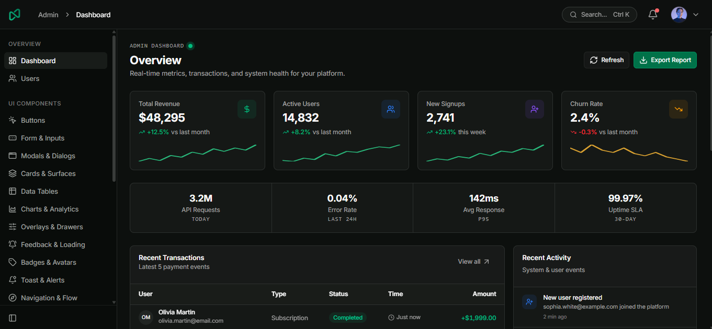

# Nala — Admin Dashboard Template

> A modern, production-ready admin dashboard template built with Vue 3, Vite, TypeScript, and Tailwind CSS v4.

[](https://nala.kenvano.web.id)
[](./LICENSE)
[](https://vuejs.org/)



---

## ✨ Features

- 🎨 **Beautiful UI** — Built with [shadcn-vue](https://www.shadcn-vue.com/) primitives via `reka-ui` (New York style)
- 🌗 **Dark / Light / Auto Theme** — System preference detection + manual toggle via `@vueuse/core`
- 📐 **Collapsible Sidebar** — Responsive layout with pixel-perfect icon alignment
- 🔍 **Global Search** — Command palette with `Ctrl+K` / `Cmd+K` shortcut
- 🔔 **Notification Center** — Dropdown with unread badge counter
- 📊 **Chart Components** — SVG-based charts (area, bar, donut, sparkline) — no external chart library needed
- 📋 **Data Table** — Powered by `@tanstack/vue-table` with sorting, filtering, and pagination
- ✅ **Form & Validation** — `vee-validate` + `zod` schema validation
- 🗂️ **Auth Flow** — Login, Register, Forgot Password, OTP Verify, Reset Password, Confirm Email
- 🚫 **Error Pages** — 404 Not Found, 500 Server Error, 403 Access Denied
- 🎯 **Component Showcase** — Buttons, Forms, Modals, Cards, Tables, Charts, Overlays, Badges, Toasts, Navigation, Typography, Colors, Icons

---

## 🛠️ Tech Stack

| Layer | Technology |
|---|---|
| Framework | Vue 3 (Composition API, `<script setup lang="ts">`) |
| Build Tool | Vite 8 |
| Package Manager | `pnpm` |
| Styling | Tailwind CSS v4 + `tw-animate-css` |
| UI Primitives | `reka-ui` + shadcn-vue (New York style) |
| Data Table | `@tanstack/vue-table` |
| Form & Validation | `vee-validate` + `@vee-validate/zod` + `zod` |
| Icons | `@lucide/vue` |
| State Management | Pinia |
| Routing | Vue Router v5 |
| Utilities | `@vueuse/core`, `axios`, `clsx`, `tailwind-merge`, `class-variance-authority` |
| Type System | TypeScript 6 + `vue-tsc` |
| Notifications / Toast | `vue-sonner` |

---

## 🔗 Live Demo

**[https://nala.kenvano.web.id](https://nala.kenvano.web.id)**

---

## 🚀 Getting Started

### Prerequisites

- [Node.js](https://nodejs.org/) v20+
- [pnpm](https://pnpm.io/) v9+ (`npm install -g pnpm`)

### Installation

```bash
# 1. Clone the repository
git clone https://github.com/candrasp/Nala.git
cd nala

# 2. Install dependencies
pnpm install

# 3. Copy environment variables
cp .env.example .env

# 4. Start the dev server
pnpm dev
```

The app will be available at **http://localhost:5173**.

---

## 📁 Project Structure

```
nala/
├── public/
│   ├── favicon.svg
│   └── screenshot.png
├── src/
│   ├── assets/
│   │   └── fonts/             # Local Inter font files (woff2)
│   ├── components/
│   │   ├── layout/            # Modular shell components (auto-imported)
│   │   │   ├── AppNavbar.vue
│   │   │   ├── AppSidebar.vue
│   │   │   ├── CommandSearchDialog.vue
│   │   │   └── NotificationDrawer.vue
│   │   ├── ui/                # UI primitive components (shadcn-vue / reka-ui)
│   │   │   ├── alert/
│   │   │   ├── alert-dialog/
│   │   │   ├── avatar/
│   │   │   ├── badge/
│   │   │   ├── breadcrumb/
│   │   │   ├── button/
│   │   │   ├── card/
│   │   │   ├── checkbox/
│   │   │   ├── command/
│   │   │   ├── date-picker/
│   │   │   ├── dialog/
│   │   │   ├── dropdown-menu/
│   │   │   ├── form/
│   │   │   ├── hover-card/
│   │   │   ├── input/
│   │   │   ├── kbd/
│   │   │   ├── label/
│   │   │   ├── loading-bar/
│   │   │   ├── pagination/
│   │   │   ├── popover/
│   │   │   ├── progress/
│   │   │   ├── radio-group/
│   │   │   ├── select/
│   │   │   ├── separator/
│   │   │   ├── sheet/
│   │   │   ├── sidebar/
│   │   │   ├── skeleton/
│   │   │   ├── slider/
│   │   │   ├── sonner/
│   │   │   ├── stepper/
│   │   │   ├── switch/
│   │   │   ├── table/
│   │   │   ├── tabs/
│   │   │   ├── textarea/
│   │   │   ├── timeline/
│   │   │   └── tooltip/
│   │   ├── AppLogo.vue
│   │   ├── CodePreview.vue    # Interactive snippet highlighter with One Dark Pro theme
│   │   └── PageHeader.vue     # Reusable standard page header primitive
│   ├── composables/
│   │   └── useFormatter.ts    # Single access point for Intl formatters (auto-imported)
│   ├── layouts/
│   │   ├── AdminLayout.vue    # Lightweight main admin shell
│   │   └── AuthLayout.vue     # Auth pages layout (login, register, etc.)
│   ├── lib/
│   │   ├── axios.ts           # Axios client with interceptors and DEV mock fallback
│   │   ├── formatters.ts      # Native Intl data formatting helpers (env-aware)
│   │   ├── utils.ts           # cn() helper = clsx + tailwind-merge
│   │   └── validation.ts      # Zod form validation schemas
│   ├── router/
│   │   └── index.ts           # Route definitions
│   ├── services/              # Real API service layer modules
│   │   ├── auth.service.ts
│   │   ├── user.service.ts
│   │   └── types.ts
│   ├── stores/
│   │   └── auth.ts            # Auth store (user session)
│   ├── views/
│   │   ├── _starter/
│   │   │   └── BlankView.vue  # Blank starter page template
│   │   ├── auth/
│   │   │   ├── LoginView.vue
│   │   │   ├── RegisterView.vue
│   │   │   ├── ForgotPasswordView.vue
│   │   │   ├── ResetPasswordView.vue
│   │   │   ├── VerifyOtpView.vue
│   │   │   └── ConfirmEmailView.vue
│   │   ├── components/        # Component showcase / documentation pages
│   │   │   ├── ButtonView.vue
│   │   │   ├── FormView.vue
│   │   │   ├── ModalView.vue
│   │   │   ├── CardView.vue
│   │   │   ├── TableView.vue
│   │   │   ├── ChartView.vue
│   │   │   ├── OverlayView.vue
│   │   │   ├── FeedbackView.vue
│   │   │   ├── BadgeAvatarView.vue
│   │   │   ├── FormatterView.vue
│   │   │   ├── ToastView.vue
│   │   │   ├── NavigationView.vue
│   │   │   ├── TypographyView.vue
│   │   │   ├── ColorsView.vue
│   │   │   └── IconsView.vue
│   │   ├── dashboard/
│   │   │   └── IndexView.vue  # Main dashboard with KPI cards + charts + table
│   │   ├── errors/
│   │   │   ├── NotFoundView.vue
│   │   │   ├── ServerErrorView.vue
│   │   │   └── UnauthorizedView.vue
│   │   ├── settings/
│   │   │   └── IndexView.vue  # Profile, Security, Notifications, Appearance tabs
│   │   └── users/
│   │       └── IndexView.vue  # User management with CRUD dialogs
│   ├── App.vue
│   ├── main.ts
│   └── style.css              # Global styles + Tailwind v4 + CSS variables (oklch)
├── .env.example
├── package.json
└── vite.config.ts
```

---

## 📄 Available Pages

### 📊 Overview & Management

| Route | Name | Description |
|---|---|---|
| `/` | Dashboard | KPI stats, area charts, sparklines, recent activity table |
| `/users` | User Management | Full CRUD dialogs with dev offline mock fallback |
| `/settings` | Settings | Multi-tab settings (Profile, Security 2FA, Notifications, Appearance) |

### 🎨 Design System & Foundations

| Route | Name | Description |
|---|---|---|
| `/components/colors` | Color Tokens | Full color token reference (oklch palette, light + dark mode) |
| `/components/typography` | Typography | Heading scales, body text, code blocks, prose |
| `/components/icons` | Icon Directory | Searchable Lucide icon catalog with JSX/Vue tag copy |
| `/components/formatters` | Formatters & Utils | Intl data helpers (Currency, Date/Time, 12h/24h, Timezone, Bytes) |

### 🧩 UI Components Showcase

| Route | Name | Description |
|---|---|---|
| `/components/buttons` | Buttons | All button variants, sizes, icons, loading, and micro-actions |
| `/components/badges` | Badges & Avatars | Pill badges, live status dots, avatar presence & group stacks |
| `/components/cards` | Cards & Surfaces | Stats cards, flush cards, ambient glow, interactive cards |
| `/components/forms` | Form & Inputs | Input variants, select, date picker, switch, slider, stepper |
| `/components/tables` | Data Tables | Sortable columns, row selection, pagination, and filters |
| `/components/charts` | Charts & Analytics | Pure SVG area, bar, donut, and sparkline inline charts |
| `/components/modals` | Modals & Dialogs | Standard dialog, alert confirm, form in modal, drawer sheet |
| `/components/overlays` | Overlays & Drawers | Tooltip, popover, hover card, and sheet panels |
| `/components/toasts` | Toast & Alerts | Sonner toast triggers (success, error, promise, action) |
| `/components/feedback` | Feedback & Loading | Skeleton loaders, progress bars, alert banners, spinners |
| `/components/navigation` | Navigation & Flow | Tabs, breadcrumbs, pagination, steppers, and timelines |

### 🔐 Authentication Suite

| Route | Name | Description |
|---|---|---|
| `/auth/login` | Login | Email/password login with demo auto-fill credentials |
| `/auth/register` | Register | Registration form with real-time password strength meter |
| `/auth/forgot-password` | Forgot Password | Recovery email request with resend cooldown timer |
| `/auth/verify-otp` | Verify OTP | 6-digit segmented OTP input with auto-advance & paste |
| `/auth/reset-password` | Reset Password | Token-based new password setup |
| `/auth/confirm-email` | Confirm Email | Email confirmation waiting state with polling simulation |

### 📄 Pages & Error States

| Route | Name | Description |
|---|---|---|
| `/starter/blank` | Blank Page | Clean starter canvas for building new features |
| `/errors/404` | 404 Not Found | Illustrated not found page with quick recovery links |
| `/errors/500` | 500 Server Error | Server error page with trace ID chip and retry simulation |
| `/errors/403` | 403 Access Denied | Polished unauthorized access guidance |

---

## 🎨 Design System

### Color Tokens

All colors use CSS custom properties based on the **oklch** color space, with full light and dark mode support.

```css
/* Key tokens */
--background / --foreground       /* Page background & primary text */
--primary / --primary-foreground  /* Brand accent (buttons, active links) */
--secondary / --secondary-foreground
--muted / --muted-foreground      /* Subtle text, placeholders */
--accent / --accent-foreground    /* Hover states */
--destructive                     /* Danger actions (delete, error) */
--border                          /* All borders */
--card / --card-foreground        /* Card backgrounds */
--sidebar / --sidebar-*           /* Sidebar-specific tokens */
```

### Theme Switching

Theme is managed via `useColorMode` from `@vueuse/core`. Three modes supported:

- `light` — Force light mode
- `dark` — Force dark mode
- `auto` — Follow OS preference (default)

---

## 🧩 Extending This Template

### Adding a New Page

1. **Create the view** — `src/views/<feature>/IndexView.vue`
2. **Register the route** — Add to `children[]` in `src/router/index.ts`
3. **Add to sidebar** — Add entry to the appropriate `nav` array in `src/layouts/AdminLayout.vue`
4. **Update page title** — Add a case to `pageTitle` computed in `AdminLayout.vue`

```ts
// 1. router/index.ts
{ path: 'products', name: 'products', component: () => import('@/views/products/IndexView.vue') }

// 2. AdminLayout.vue — mainNav array
{ name: 'Products', routeName: 'products', href: '/products', icon: Package }

// 3. AdminLayout.vue — pageTitle computed
if (route.name === 'products') return 'Product Management'
```

### Adding a Pinia Store

```ts
// src/stores/products.ts
import { defineStore } from 'pinia'

export interface Product { id: string; name: string; price: number }

export const useProductStore = defineStore('products', () => {
  const items = ref<Product[]>([])
  const isLoading = ref(false)

  async function fetchAll() {
    isLoading.value = true
    try {
      // const { data } = await axios.get('/api/products')
      // items.value = data
    } finally {
      isLoading.value = false
    }
  }

  return { items, isLoading, fetchAll }
})
```

### Adding Route Guards

The template ships without active route guards to keep it flexible. To add auth protection, update `src/router/index.ts`:

```ts
import { useAuthStore } from '@/stores/auth'

router.beforeEach((to, _from, next) => {
  const authStore = useAuthStore()
  const publicRoutes = ['login', 'register', 'forgot-password']

  if (!publicRoutes.includes(to.name as string) && !authStore.isAuthenticated) {
    next({ name: 'login' })
  } else {
    next()
  }
})
```

### Data Formatting (`useFormatter`)

All formatting helpers are **auto-imported**. Developers can use `useFormatter()` anywhere without explicit imports:

```vue
<script setup lang="ts">
const fmt = useFormatter()
</script>

<template>
  <!-- Currency (auto follows .env: USD, IDR, EUR, etc.) -->
  <span>{{ fmt.currency(1500000) }}</span>

  <!-- Date & Time (auto follows .env locale & timezone: WIB/WITA/WIT/UTC) -->
  <span>{{ fmt.date(row.createdAt, 'long') }}</span>
  <span>{{ fmt.dateTime(row.createdAt) }}</span>
  <span>{{ fmt.relative(row.lastActive) }}</span>

  <!-- Numbers & File Sizes -->
  <span>{{ fmt.number(1250000) }}</span>
  <span>{{ fmt.compact(2500000) }}</span>
  <span>{{ fmt.bytes(file.size) }}</span>
  <span>{{ fmt.initials(user.name) }}</span>
</template>
```

| Method | Example Input | Default Output (.env IDR / id-ID) | Description |
| :--- | :--- | :--- | :--- |
| `fmt.currency(val, opts?)` | `1500000` | `Rp 1.500.000` | Localized currency formatting |
| `fmt.number(val)` | `1250000` | `1.250.000` | Thousand separators |
| `fmt.compact(val)` | `2500000` | `2,5 jt` / `2.5M` | Compact metric notation |
| `fmt.date(val, style?)` | `'2026-08-21'`, `'long'` | `21 Agustus 2026` | Date (`short`, `medium`, `long`, `full`) |
| `fmt.dateTime(val, opts?)` | `ISO string` | `21 Agt 2026, 14.30` | Date with time & 24h/12h options |
| `fmt.time(val, opts?)` | `ISO string` | `14:30` (or `02:30 PM`) | Time-only (`24h`, `12h`, `showSeconds`) |
| `fmt.relative(val)` | `Date` (past/future) | `5 menit yang lalu` / `baru saja` | Human-friendly relative time |
| `fmt.bytes(val)` | `1048576` | `1 MB` | Storage byte sizes |
| `fmt.initials(name)` | `'Olivia Martin'` | `'OM'` | 2-letter uppercase Avatar fallback |

---

## ⚙️ Environment Variables

Copy `.env.example` and fill in your values:

```bash
cp .env.example .env
```

| Variable | Description | Default |
|---|---|---|
| `VITE_API_BASE_URL` | Backend API base URL | `http://localhost:3000` |
| `VITE_APP_NAME` | Application name shown in UI | `Nala` |
| `VITE_DEFAULT_LOCALE` | Global locale for dates, numbers, currency (`en-US`, `id-ID`, etc.) | `en-US` |
| `VITE_DEFAULT_CURRENCY` | Global currency code (`USD`, `IDR`, `EUR`, etc.) | `USD` |
| `VITE_DEFAULT_TIMEZONE` | Global timezone (`Asia/Jakarta`, `UTC`, etc.) | `Asia/Jakarta` |
| `VITE_DEFAULT_TIME_FORMAT` | Global time clock format (`24h`, `12h`, `auto`) | `24h` |

---

## 📦 Scripts

```bash
pnpm dev      # Start dev server with HMR (http://localhost:5173)
pnpm build    # Type-check + build for production
pnpm preview  # Preview production build locally
```

---

## 🚀 Deployment

For production deployment instructions on Vercel, Netlify, Cloudflare Pages, GitHub Pages, Docker, and Nginx VPS, see the [Deployment Guide](./DEPLOYMENT.md).

---

## 📝 License

MIT License — free to use for personal and commercial projects.

---

<p align="center">
  Built with ❤️ using Vue 3 + Vite + Tailwind CSS v4
</p>
